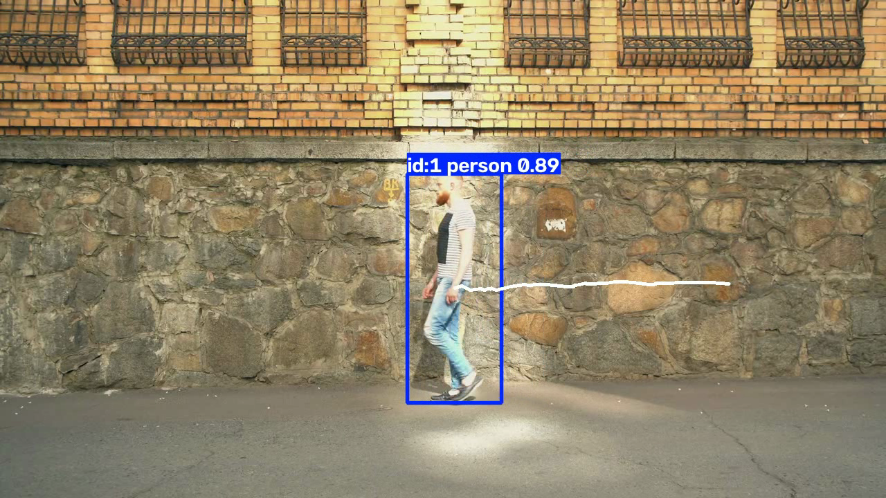
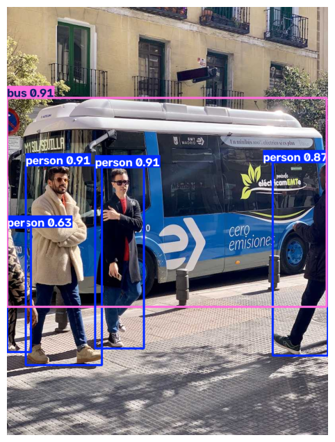
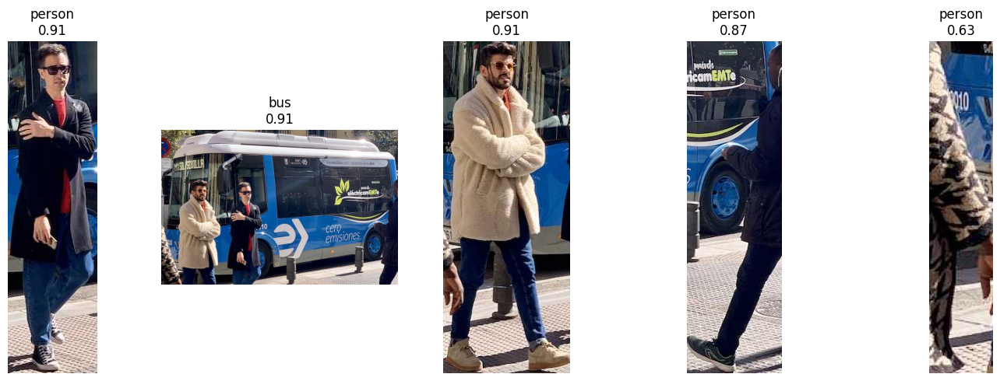
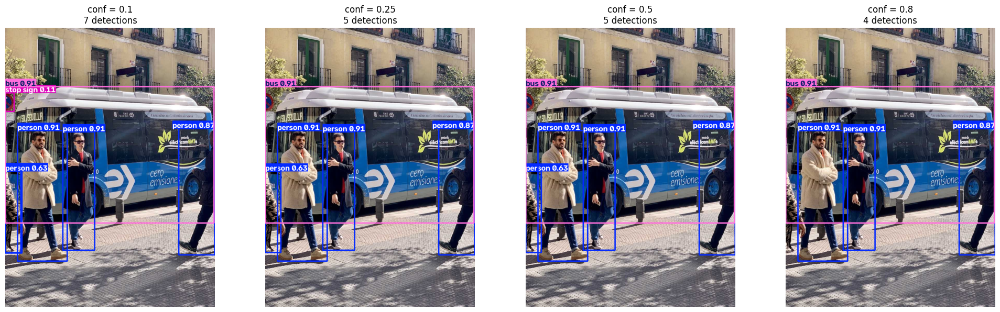
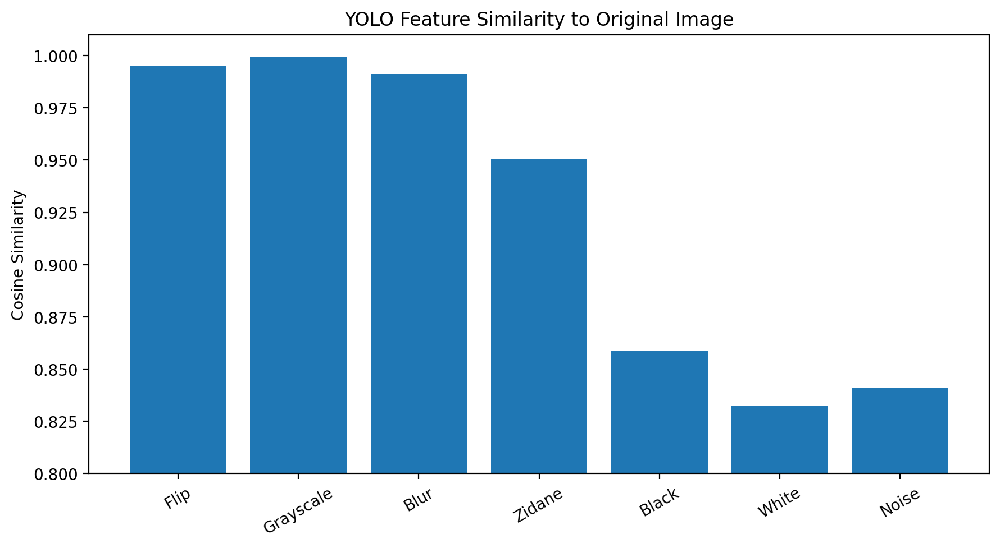

# YOLO Object Detection and Tracking

<p align="center">
  
</p>

<p align="center">
  <b>Ultralytics YOLO · Object Detection · Confidence Thresholds · Embeddings · Multi-Object Tracking · Trajectory Visualization · Object Counting</b>
</p>

<p align="center">
  <a href="README.md">English</a> |
  <a href="README_KR.md">한국어</a>
</p>

## Overview

This project explores a pretrained YOLO model beyond a single inference call.

The workflow starts with single-image object detection, then examines bounding-box outputs, confidence thresholds, IoU, and learned image embeddings. It finally extends the detector to video using multi-object tracking, trajectory visualization, and a simple line-crossing counter.

The project focuses on understanding how a pretrained detector can be used as a component of a larger computer-vision pipeline.

```text
Single-Image Detection
        ↓
Prediction Analysis
        ↓
Confidence / IoU Experiments
        ↓
Feature Embedding
        ↓
Multi-Object Tracking
        ↓
Trajectory Visualization
        ↓
Line-Crossing Counter
```

## Project Structure

```text
yolo-detection-tracking/
├── README.md
├── README_KR.md
│
├── notebooks/
│   └── 01_pretrained_yolo.ipynb
│
├── assets/
│   └── input/
│
└── results/
    └── figures/
        ├── hero.png
        ├── detection_result.png
        ├── object_crops.png
        ├── confidence_thresholds.png
        ├── embedding_similarity.png
        └── tracking_frame.png
```

The tracking videos were generated locally but are not included in the repository because of file-size limits.

## 1. Pretrained Object Detection

A pretrained YOLO model is first applied to a single image.

For each detection, the model returns:

- bounding-box coordinates
- predicted class
- confidence score

<p align="center">
  
</p>

Rather than treating the plotted image as the final result, the notebook directly inspects the returned prediction objects.

This makes it possible to understand object detection as a structured prediction problem.

## 2. Bounding Boxes and Object Crops

YOLO provides several bounding-box representations.

For a box written as

$$
(x_1, y_1, x_2, y_2),
$$

the center-width-height representation is

$$
x_c = \frac{x_1+x_2}{2},
\qquad
y_c = \frac{y_1+y_2}{2},
$$

$$
w = x_2-x_1,
\qquad
h = y_2-y_1.
$$

The predicted box coordinates were also used to crop each detected object directly from the original image.

<p align="center">
  
</p>

This shows that detector outputs can be reused directly in downstream image-processing pipelines.

## 3. Confidence Threshold Experiment

The confidence threshold controls which detections are retained.

The same image was evaluated using several thresholds:

```text
0.10
0.25
0.50
0.80
```

One experiment produced:

```text
conf=0.10 -> {'person': 5, 'bus': 1, 'stop sign': 1}
conf=0.25 -> {'person': 4, 'bus': 1}
conf=0.50 -> {'person': 4, 'bus': 1}
conf=0.80 -> {'person': 3, 'bus': 1}
```

<p align="center">
  
</p>

Lower thresholds keep more predictions, including weaker ones. Higher thresholds are more conservative but may remove valid objects.

The experiment makes the precision-recall tradeoff visible at the prediction level.

## 4. IoU and Overlapping Predictions

Intersection over Union measures the overlap between two bounding boxes.

For boxes $A$ and $B$,

$$
\operatorname{IoU}(A,B)
=
\frac{|A \cap B|}{|A \cup B|}.
$$

A pair of person detections in the experiment had

$$
\operatorname{IoU} \approx 0.9109.
$$

This experiment connects geometric overlap with duplicate predictions and NMS-style post-processing.

The notebook also examines the difference between traditional NMS-based detection and YOLO26's end-to-end prediction behavior.

## 5. Image Embedding Experiment

The pretrained model was also used to extract a 256-dimensional image embedding.

```text
Embedding shape: torch.Size([256])
```

Cosine similarity was used to compare the original image with several transformed or unrelated inputs.

For embeddings $a$ and $b$,

$$
\operatorname{cosine}(a,b)
=
\frac{a^\top b}{\|a\|\,\|b\|}.
$$

Example results:

```text
Original vs Flip       : 0.9952
Original vs Grayscale  : 0.9994
Original vs Blur       : 0.9911
Original vs Different  : 0.9504
Original vs Black      : 0.8590
Original vs White      : 0.8322
Original vs Noise      : 0.8408
```

<p align="center">
  
</p>

The embedding was highly stable under flip, grayscale conversion, and blur.

However, unrelated inputs also produced relatively high cosine similarity. This showed that a detector's raw embedding should not automatically be interpreted as a semantic-similarity metric.

## 6. Multi-Object Tracking

Detection was then extended from a single image to video.

Instead of independently detecting objects in every frame, the tracker assigns persistent IDs across time.

```text
Detection
    ↓
Frame-to-Frame Association
    ↓
Persistent Track ID
```

<p align="center">
  
</p>

This turns the question

> What objects are in this frame?

into

> Which object in this frame corresponds to the object seen previously?

## 7. Trajectory Visualization

For each tracked object, the center of its bounding box was stored over time.

If the center position at frame $t$ is

$$
p_t = (x_t, y_t),
$$

then a track history can be represented as

$$
p_1, p_2, \ldots, p_T.
$$

Connecting these points produces the object's trajectory.

Trajectory visualization is also useful as a diagnostic tool. Sudden jumps can reveal tracking failures such as an ID switch.

## 8. Line-Crossing Object Counter

The final application adds a virtual line and counts tracked objects when they cross it.

For a horizontal line at $y=y_{\text{line}}$, a downward crossing can be detected when

$$
y_{t-1} < y_{\text{line}}
$$

and

$$
y_t \ge y_{\text{line}}.
$$

The complete application pipeline becomes:

```text
Video Frame
    ↓
YOLO Detection
    ↓
Object Tracking
    ↓
Track Center
    ↓
Line-Crossing Test
    ↓
Object Count
```

This is the basic structure behind applications such as pedestrian counting, vehicle counting, CCTV analytics, and entrance monitoring.

## Key Concepts

| Topic | What was explored |
|---|---|
| Object detection | Bounding boxes, classes, confidence |
| Confidence threshold | Effect on retained predictions |
| Bounding-box formats | `xyxy`, `xywh`, normalized coordinates |
| IoU | Geometric overlap between boxes |
| NMS | Suppression of overlapping predictions |
| Object crop | Reusing detection coordinates |
| Embedding | Learned image representation |
| Cosine similarity | Similarity between feature vectors |
| Tracking | Maintaining identity across frames |
| Track ID | Temporal association of objects |
| Trajectory | Visualizing motion history |
| ID switch | Tracking association failure |
| Line crossing | Turning motion into an event |
| Object counting | Simple video analytics |

## What I Learned

This project connected several computer-vision concepts in one continuous pipeline.

I learned how to:

- inspect YOLO prediction objects directly
- interpret bounding-box coordinates and confidence scores
- compare multiple box representations
- analyze confidence-threshold behavior
- calculate IoU between predictions
- connect IoU with NMS
- crop detected objects
- extract image embeddings from a pretrained detector
- compare embeddings with cosine similarity
- recognize the limits of raw detector embeddings
- perform multi-object tracking
- use persistent track IDs
- visualize object trajectories
- identify possible ID switches
- detect line-crossing events
- build a simple object counter

## Main Takeaway

The main lesson of this project is that a pretrained detector becomes much more useful when its outputs are treated as data rather than only as a final visualization.

Bounding boxes can be cropped and compared, detections can be associated through time, trajectories can be reconstructed, and tracked motion can be converted into higher-level events.

The final progression was:

```text
Detection
   ↓
Analysis
   ↓
Tracking
   ↓
Trajectory
   ↓
Event Detection
```

## Tools

```text
Python
PyTorch
Ultralytics YOLO
OpenCV
Matplotlib
Torchvision
Jupyter Notebook
```

## Notes

- A pretrained YOLO model was used; the detector itself was not trained or fine-tuned.
- Detectable classes are limited by the pretrained label space.
- Tracking performance depends on both detection quality and frame-to-frame association.
- The line counter is application logic built on top of tracking rather than a separately trained model.
- Video outputs were generated locally and omitted from the repository because of file-size limits.
